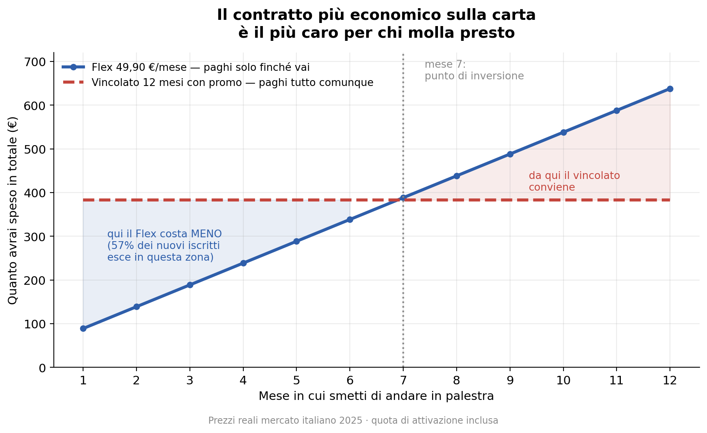
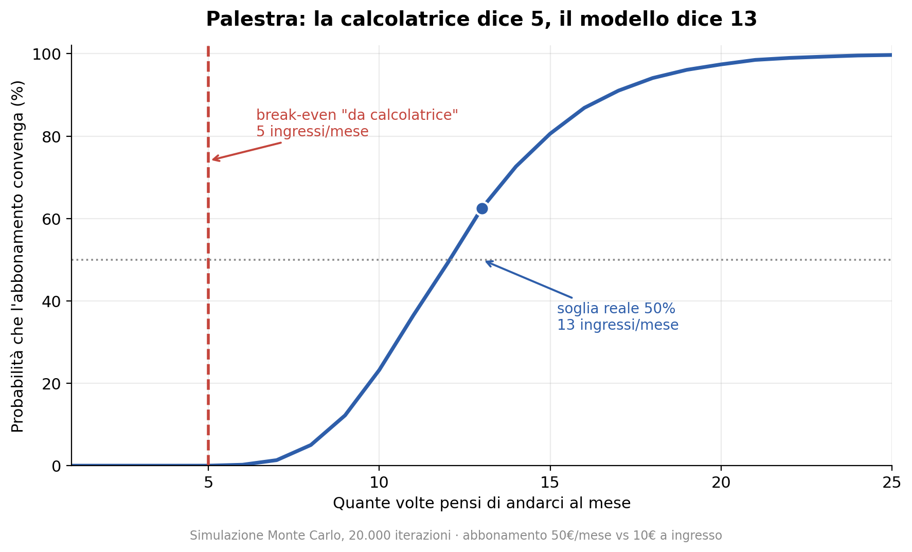

# 💪 Quando conviene comprare un abbonamento?

Un modello probabilistico di break-even applicato agli abbonamenti di uso quotidiano
(palestra, trasporto pubblico, coworking). La domanda sbagliata è *"quanto costa"*.
Quella giusta è *"quante volte ci andrai davvero"*.

[](https://colab.research.google.com/github/TUO-USERNAME/quando-conviene-abbonamento/blob/main/notebook/quando_conviene_abbonamento.ipynb)

> ⚠️ Sostituisci `TUO-USERNAME` nel link qui sopra con il tuo username GitHub.

---

## 💡 TL;DR

- 🧮 **Break-even "da calcolatrice":** una divisione. Ed è ottimista per costruzione, perché assume che tu sappia già quante volte ci andrai.
- 🎯 **Break-even reale:** chi dichiara *"ci vado 2-3 volte a settimana"* (10/mese) ne fa in media **4,3** secondo la calibrazione sul paper del 2006, **7,0** con i dati di settore 2024. Il gap col calcolo semplice si assottiglia con i dati recenti, ma non sparisce.
- 🚪 **L'abbandono è il fattore che nessuno mette nel conto.** Retention annua del settore: **66,4%** (HFA 2025, 175 aziende e 17.000+ strutture). Tra i nuovi iscritti, circa **metà molla entro 6 mesi**.
- 📜 **Il paradosso del vincolo:** il contratto più economico sulla carta (promo "primi 3 mesi a 10 €", vincolo 12 mesi, 383 € l'anno) diventa **il più caro per ingresso** quando includi l'abbandono. Il Flex a 49,90 €/mese — apparentemente la fregatura — costa meno a chi molla presto.
- ⏱️ **Punto di inversione: il mese 7.** Prima conviene il Flex, dopo il vincolato. Circa il **57% dei nuovi iscritti esce prima del mese 7**.
- 🚌 **Trasporto pubblico:** qui la calcolatrice ci prende (23 vs 25 corse/mese). Comportamento prevedibile → il modello probabilistico non aggiunge molto. Serve dove c'è incertezza, non ovunque.

## 📊 Grafici





*Gli altri grafici — distribuzione del risparmio, propositi vs realtà, costo per ingresso per contratto — sono nel notebook e in `figures/`.*

## 🛠️ Quick start

Zero installazioni, gira nel browser:

[](https://colab.research.google.com/github/TUO-USERNAME/quando-conviene-abbonamento/blob/main/notebook/quando_conviene_abbonamento.ipynb)

Poi `Runtime → Esegui tutto`. Numpy, pandas e matplotlib sono già installati su Colab.

**In locale**, se preferisci:
```bash
git clone https://github.com/TUO-USERNAME/quando-conviene-abbonamento.git
cd quando-conviene-abbonamento
pip install -r requirements.txt
jupyter notebook notebook/quando_conviene_abbonamento.ipynb
```

## 🔬 Metodologia

1. **L'utilizzo è una variabile casuale, non un numero fisso.** Gli ingressi mensili seguono
   una **Binomiale Negativa** invece di una Poisson, perché il comportamento umano ha più
   varianza di quanto la sola media catturi (mesi pieni, mesi a zero):

$$\mathrm{Var} = \mu + \frac{\mu^2}{r}$$

2. **Due bias comportamentali separati.** *Ottimismo* all'iscrizione (sopravvaluti quanto
   userai il servizio) e *decadimento dell'abitudine* nel tempo (l'entusiasmo cala e si
   stabilizza su un plateau), calibrati sui dati reali dello studio citato sotto:

$$\mu_m = P + (I - P)\cdot d^{\,m}, \qquad I = \text{ottimismo} \times \text{frequenza dichiarata}$$

3. **Simulazione Monte Carlo.** 20.000 "vite possibili" per ogni scenario di frequenza
   dichiarata. L'output non è più un sì/no ma una **probabilità di convenienza** e una
   distribuzione del risparmio, con seed fisso (`default_rng(42)`) per la riproducibilità.

4. **Analisi di sensibilità.** I parametri comportamentali vengono fatti variare
   (ottimismo 0,65 → 1,00; irregolarità r = 1 → 5) per verificare che la direzione del
   risultato non dipenda dalla calibrazione scelta.

5. **Abbandono (churn).** Un processo di sopravvivenza separato determina il mese in cui
   la persona smette del tutto: hazard costante calibrato sul dato HFA 2025, oppure hazard
   decrescente per il nuovo iscritto. Dopo l'abbandono la frequenza va a zero — ma con
   un contratto vincolato **il pagamento no**.

6. **Contratti reali.** Quattro formule del mercato italiano 2025 (Flex senza vincolo,
   Standard 12 mesi, annuale prepagato, promo sui primi mesi), con quote di attivazione
   e vincoli di durata modellati esplicitamente.

## ⚠️ Limiti

- Il modello sceglie tra abbonamento e ingressi singoli su un **orizzonte fisso di 12 mesi**.
  Non ottimizza la scelta nel tempo (es. Flex per i primi mesi, poi passaggio all'annuale
  una volta verificata l'abitudine), che è probabilmente la strategia migliore nella realtà.
- I parametri di frequenza sono calibrati su fonti eterogenee: un paper accademico del 2006
  e statistiche di settore recenti, alcune pubblicate da fornitori di software per palestre
  e quindi non peer-reviewed. Il dato sulla retention (66,4%) è il più solido.
- Il tasso di abbandono dei nuovi iscritti (~50% entro 6 mesi) è una stima largamente citata
  nel settore ma di provenienza meno rigorosa rispetto al dato HFA.
- Solo costo monetario. Restano fuori la comodità di non pensare a pagare ogni volta,
  l'effetto motivazionale del vincolo, sospensioni e congelamenti, cessione del contratto
  a terzi, penali di disdetta anticipata.
- I prezzi sono di catene low-cost italiane nel 2025: cambiano per città, struttura e periodo.

## 📄 Fonti

- DellaVigna, S. & Malmendier, U. (2006). *Paying Not to Go to the Gym*.
  **American Economic Review**, 96(3), 694–719. [DOI: 10.1257/aer.96.3.694](https://doi.org/10.1257/aer.96.3.694)
- Health & Fitness Association, *2025 Fitness Industry Benchmarking Report* — retention annua
  66,4%, su 175 aziende e oltre 17.000 strutture in 27 paesi (dati 2024).
- Condizioni contrattuali e listini pubblici di catene fitness italiane, 2025.

## Struttura

```
├── notebook/
│   └── quando_conviene_abbonamento.ipynb   # l'analisi completa
├── figures/                                 # grafici generati
├── requirements.txt
└── README.md
```

## Licenza

MIT
